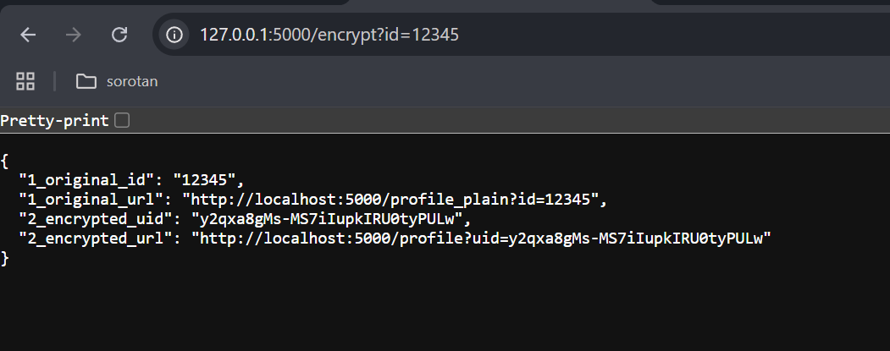
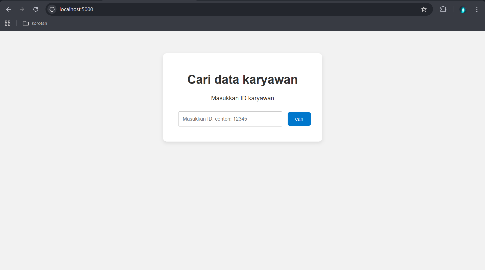

# Simple program encrypted url with AES 
Enkripsi AES (Advanced Encryption Standard) adalah salah satu algoritma kriptografi simetris modern yang digunakan untuk mengamankan data dengan cara mengubah data asli (plaintext) menjadi data acak (ciphertext) menggunakan sebuah kunci rahasia (secret key).

program ini dibuat dengan python dan framework flask untuk mendemonstrasikan cara kerja AES secara sederhana pada url web

## Penjelasan Program 
### library
```python
from flask import Flask, request, render_template, jsonify
from Crypto.Cipher import AES
import base64
import hashlib
```
* Flask → framework web Python.
* request → ambil data dari URL (misal ?id=12345).
* render_template → untuk load file HTML (index.html).
* jsonify → kirim data JSON ke browser (API).
* AES → algoritma enkripsi/dekripsi.
* base64 → encode hasil enkripsi jadi teks supaya aman dimasukkan ke URL.
* hashlib → bikin kunci rahasia (hash SHA-256).

### flask
inisialisasi web dengan flask
```python
app = Flask(__name__)
```
### KEY AES
```python
SECRET_KEY = hashlib.sha256(b"yangbikintampansekali").digest()
```
* Password "yangbikintampansekali" diubah ke hash SHA-256 → menghasilkan 32 byte.
* AES butuh key 16/24/32 byte → jadi ini cocok.

### Data dummy untuk demo
```python
users = {
    "12345": {"name": "zaky", "isi": "hallooo gaes"},
    "67890": {"name": "fadil", "isi": "haiiiii"},
}
```
### Fungsi Enkripsi
``` python
def encrypt(text):
    cipher = AES.new(SECRET_KEY, AES.MODE_EAX)
    ciphertext, tag = cipher.encrypt_and_digest(text.encode())
    return base64.urlsafe_b64encode(cipher.nonce + ciphertext).decode()
```
* Buat objek cipher AES dengan kunci rahasia.
* Enkripsi text jadi ciphertext.
* Gabung nonce (kode unik) + hasil enkripsi.
* Encode ke Base64 biar bisa ditaruh di URL.

### Fungsi Deskripsi
```python
def decrypt(encrypted_text):
    raw = base64.urlsafe_b64decode(encrypted_text)
    nonce = raw[:16]             # ambil nonce
    ciphertext = raw[16:]        # ambil ciphertext
    cipher = AES.new(SECRET_KEY, AES.MODE_EAX, nonce=nonce)
    decrypted = cipher.decrypt(ciphertext)
    return decrypted.decode()
```
* Decode dulu dari Base64.
* Pisahkan nonce dan ciphertext.
* Dekripsi pakai kunci yang sama.
* Hasil akhirnya = teks asli (misalnya ID 12345).

### API Enkripsi
```python
@app.route("/encrypt")
def encrypt_route():
    user_id = request.args.get("id", "")
    if not user_id:
        return "?id=....", 400
    uid = encrypt(user_id)
```
* Input: http://localhost:5000/encrypt?id=12345
* Output: JSON berisi ID asli, URL asli, UID terenkripsi, dan URL terenkripsi.

### Tampilan Json 
menggunakan jsonify untuk membuat dua url agar mudah dibandingkan
```python
    return jsonify({
        #asli
        "1_original_id":user_id,
        "1_original_url":f"http://localhost:5000/profile_plain?id={user_id}",
        #enkrip
        "2_encrypted_uid":uid,
        "2_encrypted_url":f"http://localhost:5000/profile?uid={uid}"
    })
```
### output


### Halaman profil Polos dari url asli
```python
@app.route("/profile_plain")
def profile_plain():
    user_id = request.args.get("id", "")
    if not user_id:
        return "Hasil ?id=asli", 400
    if user_id in users:
        data = users[user_id]
        return f"""
        <h1>Profil User (polos)</h1>
        <p><b>ID:</b> {user_id}</p>
        <p><b>Nama:</b> {data['name']}</p>
        <p><b>isi:</b> {data['isi']}</p>
        """
    else:
        return f"User dengan ID {user_id} tidak ada!"
```
* Mengambil parameter id dari URL (?id=...).
* Mengecek apakah id ada di dalam dictionary users.
* Jika ada → menampilkan profil user (ID, Nama, Isi).
* Jika tidak ada → menampilkan pesan bahwa user tidak ditemukan.
### output


### Halaman profil enkrip dari url encripted
```python
@app.route("/profile")
def profile_route():
    uid = request.args.get("uid", "")
    if not uid:
        return "Hasil ?uid=enkrip", 400
    try:
        user_id = decrypt(uid)
        if user_id in users:
            data = users[user_id]
            return f"""
            <h1>Profil User (enkrip)</h1>
            <p><b>ID:</b> {user_id}</p>
            <p><b>Nama:</b> {data['name']}</p>
            <p><b>isi:</b> {data['isi']}</p>
            """
        else:
            return f"User dengan ID {user_id} tidak ada!"
    except:
        return "UID tidak valid!", 400
```
* Mengambil parameter uid dari URL (?uid=...).
* uid ini adalah ID terenkripsi.
* Sistem mencoba mendekripsi uid → jadi user_id asli.
* Jika hasil dekripsi cocok dengan data di users, maka profil ditampilkan.
* Jika uid salah/invalid, akan muncul error "UID tidak valid!".
### output


### requirement.txt
```
flask
pycryptodome
```

### Cara menjalankan demo 

* Buka terminal di folder enkripaes
* Buat virtual environment:
```
python -m venv venv
```
* Aktifkan venv:
```
venv\Scripts\activate
```
* install dependency
```
pip install -r requirements.txt
```
* jalankan server:
```
python app.py
```
* Buka browser ke: http://localhost:5000


### apa itu venv
`venv` adalah singkatan dari **virtual environment**.
Bayangkan seperti bikin **ruangan khusus** untuk project Python kamu.

### 🔹 Kenapa perlu pakai `venv`?

* **Isolasi Project** → Setiap project bisa punya versi library sendiri.
  (Misalnya: Project A pakai Flask 2.0, sementara Project B pakai Flask 3.0, dan keduanya tidak bentrok).
* **Lebih Aman** → Update library di luar tidak akan merusak project kamu.
* **Lebih Rapi & Profesional** → Semua library yang di-install (`pip install ...`) masuk ke folder `venv/`, bukan ke Python global.

### Intinya

Dengan `venv`, kamu bisa bikin project Python yang lebih rapi, aman, dan fleksibel. Hampir semua developer Python pakai ini supaya project tetap terkontrol.

### Susunan folder dan file
```
ENKRIPEAS/
│── venv/                 # Virtual environment (dibuat otomatis)
│── app.py                # File utama Flask (server + AES)
│── requirements.txt       # Daftar dependency
│
└── templates/             # Folder untuk HTML
    └── index.html
└── static/                # Folder untuk CSS/JS
    └── style.css
```


